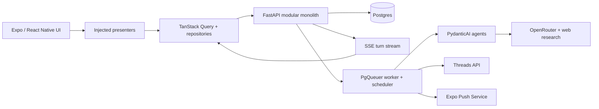

# ThinkSo

> One of you is wrong. Write it down. We'll keep the receipts.

ThinkSo turns a casual claim into an immutable social contract. One person creates a challenge, another accepts it, an evidence-backed AI judge resolves it later, and ThinkSo publishes the exact consequence the loser approved in advance.

The product loop is simple: **write it down → put it on the record → sign it → wait → judgment → receipt.**

> **Project status:** product behavior, UX, system architecture, and the full-stack delivery plan are specified. The React Native and backend foundations are the next implementation milestone. The images below are design concepts, not production screenshots.

[Browse the screens and acceptance criteria](./SCREENS.md) · [Read the product overview](./wiki/product/overview.md) · [See the implementation backlog](./wiki/tickets/index.md)

## Product concept

The minting agent turns natural-language trash talk into precise, judgeable terms. It researches ambiguous events, defines the acceptance and judgment windows, and produces an explicit proposal before anything can be sent.

<table>
  <tr>
    <td width="33%" valign="top">
      
      <br /><sub><strong>Create:</strong> research-backed conversation becomes an explicit proposal.</sub>
    </td>
    <td width="33%" valign="top">
      
      <br /><sub><strong>The Record:</strong> pending, active, and judging contracts in one deliberately compact view.</sub>
    </td>
    <td width="33%" valign="top">
      
      <br /><sub><strong>The Contract:</strong> participants, consequences, resolution terms, and timing remain visible in one canonical record.</sub>
    </td>
  </tr>
</table>

The visual language is intentionally specific: institutional forms and legal records disrupted by blue-pen notebook vandalism. The application stays disciplined enough to make commitments legible while retaining the personality of an argument between friends.

## What makes it interesting

ThinkSo is a small product with unusually deep systems problems:

- **Bounded AI agents.** Separate minting and judging agents use typed tools and validated outputs. Models can research and propose; deterministic application code owns permissions, state transitions, dates, spend limits, and side effects.
- **Durable asynchronous work.** Agent turns stream over SSE, judgment runs on a schedule, Threads publication survives retries, and ambiguous external outcomes are reconciled before anything is posted twice.
- **Real identity and commitment.** Google and Apple login can converge on one account, Threads authorization is required for participation, and accepted contracts cannot be silently edited or withdrawn.
- **Explicit mobile boundaries.** DTO, domain, and UI models remain separate. TanStack Query owns server state; injected presenters own presentation logic and expose a typed unidirectional event API; React Native components render state and emit events.
- **Full-stack delivery.** Work is divided into small vertical slices spanning mobile, API, persistence, agents, background jobs, tests, and documentation—not disconnected frontend/backend phases.

## Architecture



The target repository is a single, reviewable monorepo:

```text
ThinkSo/
├── apps/mobile/              # Expo + React Native application
├── services/api/             # FastAPI API, worker, scheduler, and agents
├── packages/api-client/      # Generated OpenAPI types and transport
├── docs/readme-assets/       # Public-facing design imagery
├── wiki/                     # Product, BDD, architecture, decisions, tickets
├── raw/                      # Immutable design and research sources
├── compose.yaml              # Local Postgres/API/worker environment
└── justfile                  # Human and agent command menu
```

### Planned stack

| Surface | Technologies and boundaries |
|---|---|
| Mobile | Expo, React Native, TypeScript, Expo Router, TanStack Query, React Obsidian, React Native Testing Library |
| Backend | Python, FastAPI, Pydantic, Dishka, async SQLAlchemy/psycopg, Alembic, Postgres |
| Agents | PydanticAI, OpenRouter, typed research and mutation ports, persisted turns and citations |
| Background work | PgQueuer with separate HTTP, worker, and scheduler entrypoints |
| Contract | FastAPI OpenAPI → generated TypeScript types and `openapi-fetch` transport |
| Quality | Ruff, mypy, pytest, ESLint, Prettier, TypeScript, Jest, GitHub Actions |

Runtime versions and a few foundation choices remain proposals until the first scaffolding review. See the [foundation configuration review](./wiki/delivery/foundation-configuration-review.md) for the exact status of each choice.

## Engineering approach

The repository is designed to make behavior inspectable and change safe:

- Screen and agent behavior is specified as numbered Given/When/Then cases tied to the actual design sources.
- The backend is a feature-oriented modular monolith with application-owned transactions and dependency injection at process boundaries.
- Mobile presentation logic is unit-testable without rendering the component tree; screens do not receive network DTOs or call transports directly.
- Agent prompts are not trusted as enforcement. Tool schemas and domain operations revalidate every meaningful mutation.
- Unit tests ship with each implementation slice. Native end-to-end verification is a separate nightly/release concern.
- Each ticket becomes a small full-stack pull request in a native GitHub PR stack, with independent code and UI verification.

The internal wiki is part of the engineering system, not a pile of notes. It distinguishes **LOCKED** product decisions from **DERIVED** implementation choices, **OPEN** questions, and explicitly deferred work.

## Documentation map

- [Screens, BDD, and visual sources](./SCREENS.md)
- [Canonical API specification](./wiki/api/api-specification.md)
- [Data model and state machines](./wiki/data/data-model-and-state-machines.md)
- [Mobile Presenter/UDF architecture](./wiki/architecture/mobile-client-architecture.md)
- [Backend architecture](./wiki/architecture/backend-architecture.md)
- [Agent architecture and spend controls](./wiki/architecture/agent-architecture.md)
- [Vertical-slice implementation plan](./wiki/delivery/vertical-slice-plan.md)
- [Ordered full-stack ticket tracker](./wiki/tickets/index.md)
- [Decision register](./wiki/decisions/decision-register.md)

## Scope

The MVP is deliberately narrow: no feed, discovery, friends list, stats dashboard, search, or notification center. ThinkSo is about creating, accepting, judging, and preserving one kind of social commitment well. Automated prompt optimization and generalized agent-evaluation infrastructure come after the working vertical slice and an observed failure corpus.

## Repository status and access

The public repository is <https://github.com/dmitchelljackson/ThinkSo>. This workspace has not been pushed yet; the first audited push will follow approval of the foundation configuration and executable skeleton.

ThinkSo is **source-available, not open source**. Copyright © 2026 Mitchell Jackson; all rights are reserved. GitHub-native viewing and forking remain subject to GitHub's Terms of Service, but no general permission is granted to use, modify, distribute, or commercialize the project. See [COPYRIGHT.md](./COPYRIGHT.md) and [CONTRIBUTING.md](./CONTRIBUTING.md).
